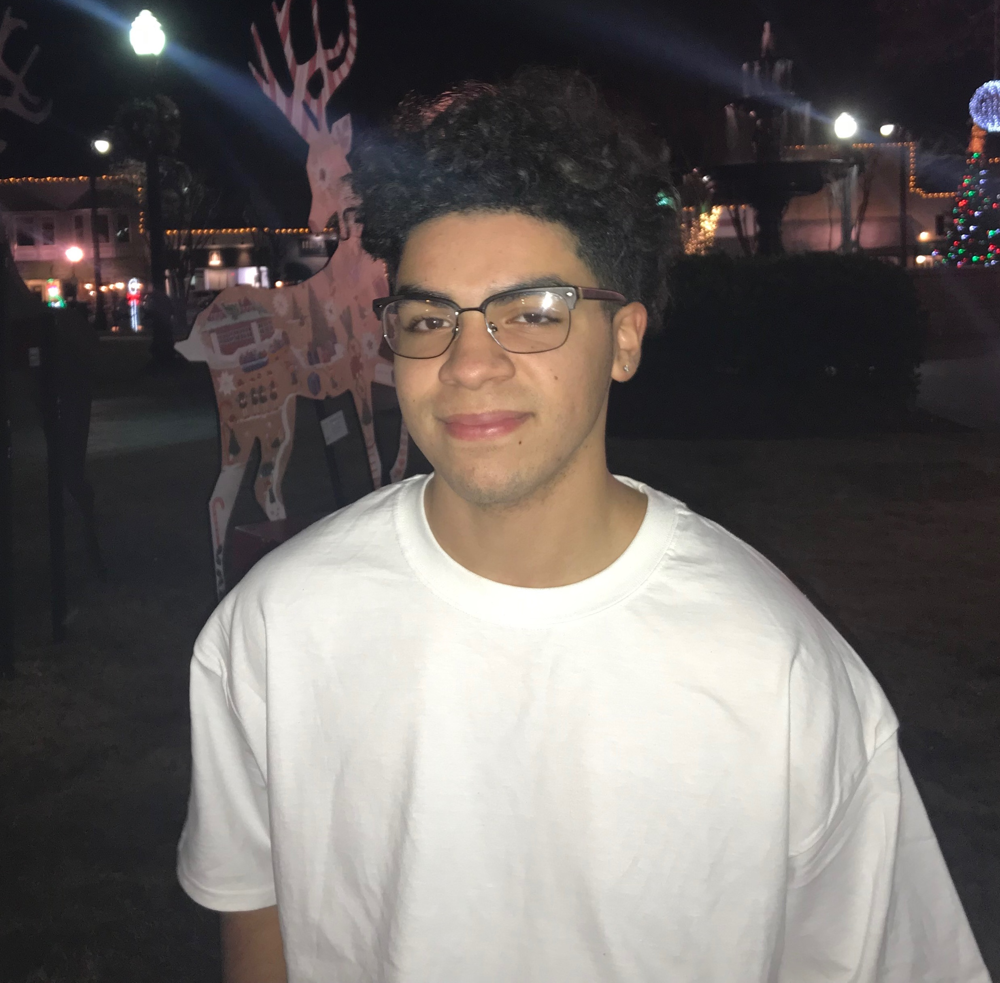

## About Me

Hello,

I am a graduate student at the University of Georiga pursuing an MS in artificial intelligence. Prior to my MS, I completed my BA in cognitive science with a minor in statistics, also at UGA.

## Research Interest

I am mainly interested in the intersection between neuroscience and AI and the fundemental characteristics of intelligence that define them both. I am currently working on my master's thesis, where I use vision transformer models to recognize emotions from EEG data.