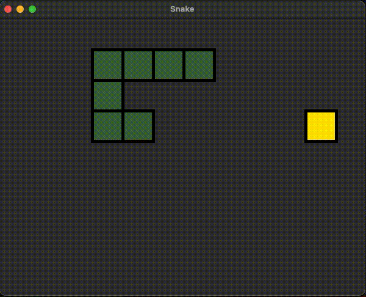
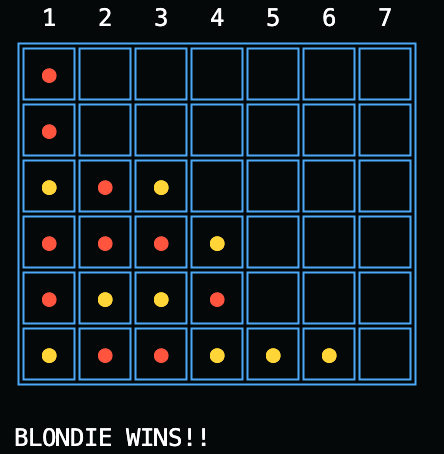

## [Recognizing Emotions from EEG Data with Vision Transformers and Continuous Wavelet Transform](https://github.com/agustin-lorenzo/emotion-recognition-thesis)
##### *Master's Thesis, Institute for Artificial Intelligence, University of Georgia*

* Preprocessing EEG data from [DEAP](https://www.eecs.qmul.ac.uk/mmv/datasets/deap/download.html) dataset
* Extracting continuous wavelet transform features from EEG data using [fCWT](https://github.com/fastlib/fCWT) library
* Training vision transformers from [vit-pytorch](https://github.com/lucidrains/vit-pytorch#3d-vit) on CWT features
* Finetuning pretrained vision transformer for private dataset

---

## [SnakeAI](https://github.com/agustin-lorenzo/snakeAI)
##### *Personal project*

* Creating Snake from scratch using C++ and [SFML](https://www.sfml-dev.org/index.php) library
* Implenting AI-mode with greedy pathfinding algorithm

---

## [Blondie24 on Connect4](https://github.com/Loganj5904/Connect4EP)
###### *Evolutionary Computation Term Project*

* Adapting [Blondie24](https://en.wikipedia.org/wiki/Blondie24) algorithm to a new environment
* Programmed a neural network model to evaluate board states during minimax search
* Trained network weights using evolutionary strategies
* Compared Blondie24 algorithm to modern evolutionary programming algorithm