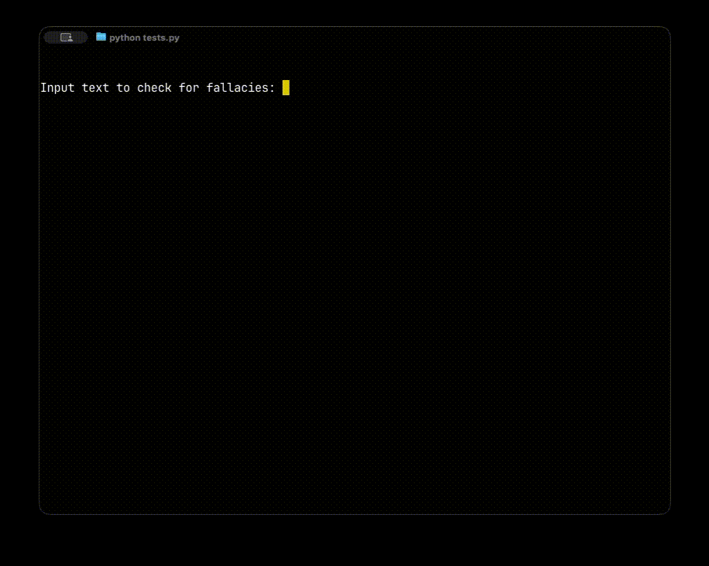
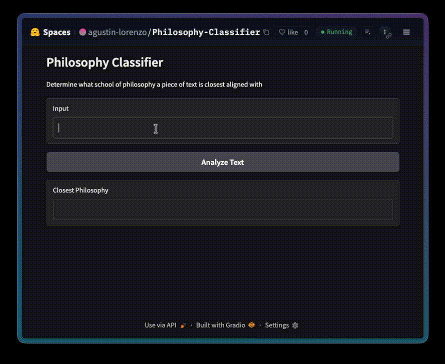

# Statement on Generative AI

I realize that today, with the advent of "vibe-coding" it is easier than ever to develop small scale projects for a portfolio. With that in mind, I want to make it clear that, for my recreational work, I make it a point to use **as little generative AI as possible** throughout the development process.

I do these projects for fun, and for the learning experience. In the rare cases where I do use generative AI, I use it as a last resort, and I make a real effort to *learn from it* rather than just prompting it to complete the project -- in my eyes, that defeats the purpose.

For the following projects, I always aimed to minimize the use of generative AI while prioritizing the learning process over the "finished product".

---
---

## [Fallacy Detector](https://huggingface.co/spaces/agustin-lorenzo/fallacy-detector)
#### *Finetuned BERT models that detect and classify potential fallacies found in a string of text*

* Gathered datasets for detecting and classifying multiple fallacies found in text entries
* Generated synthetic data by utilizing LLMs to add or remove fallacies from real-world examples
* Finetuned model to either detect whether a fallacy is present in text
* Finetuned model for multi-label classification to identify most likely fallacies present
* Hosted on Hugging Face Spaces with Gradio UI
* Currently implementing RESTful API with rate limiting and request logging for scalable inference and programmatic access

---

## [Philosophy Classifier](https://huggingface.co/spaces/agustin-lorenzo/Philosophy-Classifier)
#### *Finetuned BERT classifier that determines what school of philosophy a piece of text is closest aligned with*

* Curated dataset containing text entries that represent four schools of philosophy
* Finetuned DistilBERT model on dataset
* Hosted on Hugging Face Spaces with Gradio UI

---

## [wordnav.net](https://www.wordnav.net)
#### *Web puzzle game where you string together two-word phrases to navigate from one word to another*

* Generating small dataset of two-word phrases
* Constructing graph object containing word relationships and navigating with DFS to obtain chain of words
* Implementing front-end interface with [Hyperdiv](https://hyperdiv.io/) framework in Python

---

## [Recognizing Emotions from EEG Data with Vision Transformers and Continuous Wavelet Transform](https://github.com/agustin-lorenzo/emotion-recognition-thesis)
#### *Master's Thesis, Institute for Artificial Intelligence, University of Georgia*

* Preprocessing EEG data from [DEAP](https://www.eecs.qmul.ac.uk/mmv/datasets/deap/download.html) dataset
* Extracting continuous wavelet transform features from EEG data using [fCWT](https://github.com/fastlib/fCWT) library
* Training vision transformers from [vit-pytorch](https://github.com/lucidrains/vit-pytorch#3d-vit) on CWT features
* Finetuning pretrained vision transformer for private dataset

---

## [retroAI](https://github.com/agustin-lorenzo/retroAI)
#### *Personal project*

* Implementation of NEAT (Neuroevolution of Augmenting Topologies) algorithm
* Evolving neural network topologies based on success in retro video game environment
* Evolved network to play retro games like Ms. Pacman

---

## [snakeAI](https://github.com/agustin-lorenzo/snakeAI)
#### *Personal project*

* Creating Snake from scratch using C++ and [SFML](https://www.sfml-dev.org/index.php) library
* Implenting AI-mode with greedy pathfinding algorithm

---

## [Blondie24 on Connect4](https://github.com/Loganj5904/Connect4EP)
#### *Evolutionary Computation Term Project*

* Adapting [Blondie24](https://en.wikipedia.org/wiki/Blondie24) algorithm to a new environment
* Programmed a neural network model to evaluate board states during minimax search
* Trained network weights using evolutionary strategies
* Compared Blondie24 algorithm to modern evolutionary programming algorithm
